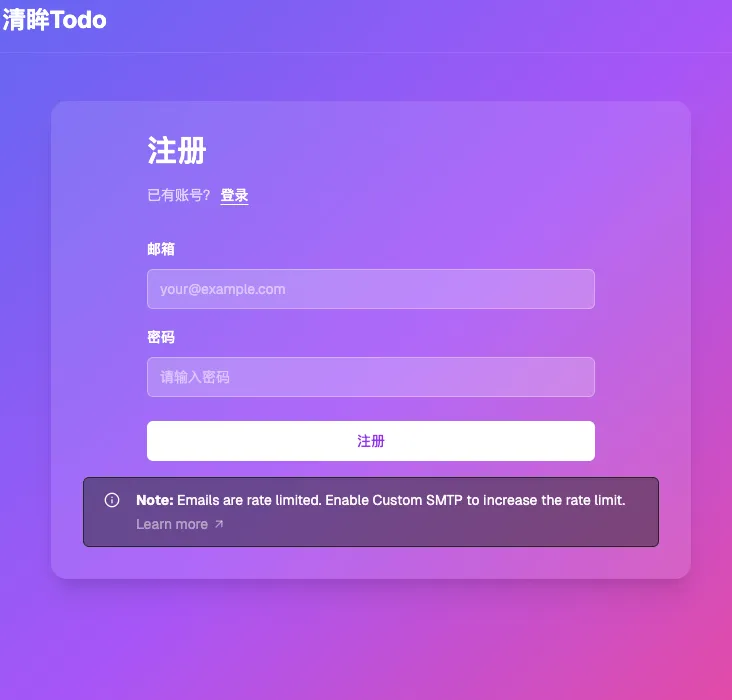
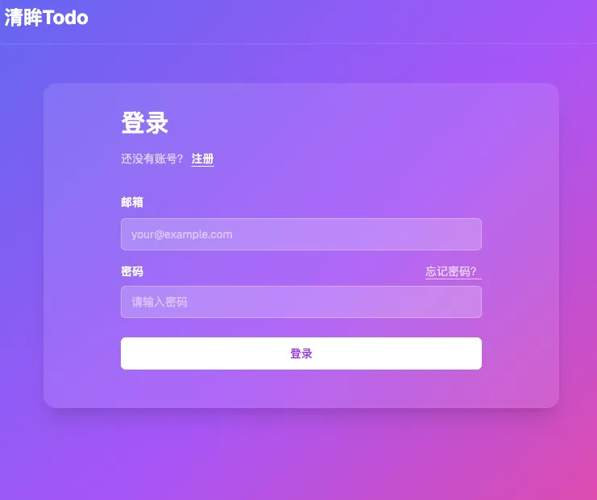
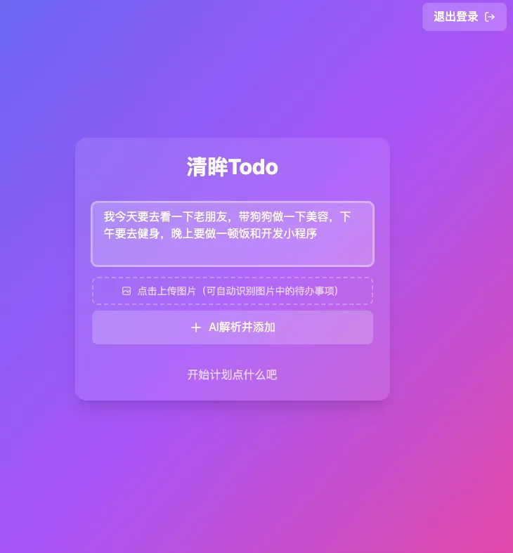
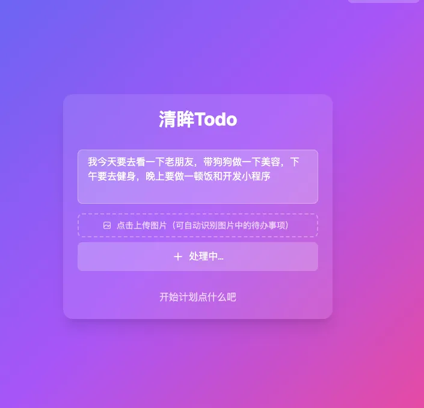
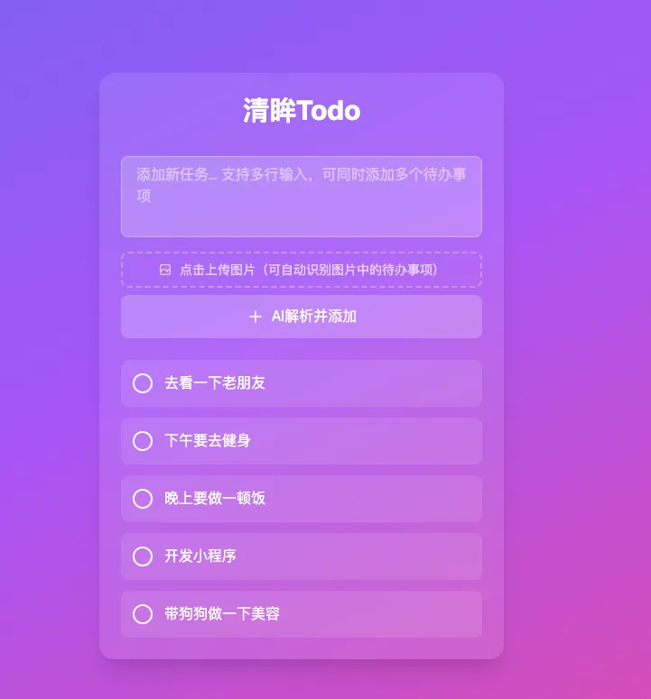

# with-supabase-app-deepseek

[🌐 Demo](https://demo-nextjs-with-supabase.vercel.app)

一个以 **Next.js + Supabase** 为基础的全栈模板项目，包含认证、数据库、存储及 UI 预设，帮助你 **快速启动现代 Web 应用**。

这个模板借鉴了 Supabase 官方 Starter 的结构，并加入常见实用功能与最佳实践，是构建自定义应用的坚实基础。:contentReference[oaicite:2]{index=2}

---

## 🚀 快速开始

### 📦 克隆仓库

```bash
git clone https://github.com/KapiYue/with-supabase-app-deepseek.git
cd with-supabase-app-deepseek
````

### 🔧 安装依赖

```bash
pnpm install
```

或使用 npm / yarn：

```bash
npm install
yarn install
```

### 📄 配置环境变量

基于 `.env.example` 创建 `.env.local`：

```
NEXT_PUBLIC_SUPABASE_URL=your_supabase_url
NEXT_PUBLIC_SUPABASE_ANON_KEY=your_supabase_anon_key
```

这些值可以从 Supabase 控制台项目的 API 设置中获取。([docs.memfiredb.com][3])

### 🏁 启动开发服务器

```bash
pnpm dev
```

浏览器打开：`http://localhost:3000`

---


## 🎨 界面设计 

- 简洁克制（Minimal but expressive）

- 功能优先（Function first）

- 内容聚焦（Content-driven layout）

- 组件可复用（Composable UI）

| 注册               | 登录              | 
| ----------------- | ----------------- |
|  |  |


| 首页                   | 创作页面               | 生成页面               | 完成页面               |
| --------------------- | --------------------- | --------------------- | ---------------------|
|  |  |  |        |


---

## 💡 主要功能亮点

* ⚙️ 支持 **Next.js App Router + Server Components**
* 🔐 集成 Supabase **Auth 身份验证**
* 📦 自动配置 **Supabase 客户端 & SSR 支持**
* 💾 集成数据库、存储、RLS 等
* 🎨 基于 **shadcn/ui + Tailwind CSS** 的组件系统
* 📍 适合快速扩展、部署与二次开发

---

## 🧠 技术架构

```
Next.js (App Router) + Supabase
├── app/                     # 页面路由
├── components/              # UI 组件
├── lib/                     # Supabase 客户端封装
├── utils/                   # 工具函数
├── sql/                     # SQL table / RLS 脚本
├── public/                  # 静态资源
└── README.md                # 项目文档
```

主要集成了：

* Supabase Auth & Database
* Tailwind CSS + shadcn/ui
* SSR 认证流程支持

---

## 📌 核心配置说明

### 🔑 环境变量说明

| 名称                              | 描述                |
| ------------------------------- | ----------------- |
| `NEXT_PUBLIC_SUPABASE_URL`      | Supabase 项目 URL   |
| `NEXT_PUBLIC_SUPABASE_ANON_KEY` | Supabase 匿名访问 Key |

确保不要将私密 `SERVICE_ROLE` Key 放到前端环境中，这会带来安全风险。([docs.memfiredb.com][3])

---

## 🧪 演示内容和示例

本模板已包含基础的用户认证、界面布局与状态管理，你可以基于它：

* 快速实现登录/注册流程
* 添加受保护路由
* 使用 Supabase Storage 上传文件
* 配置 RLS 安全策略

示例代码可以在 `components/` 与 `app/` 路径下查看。

---

## 📦 部署指南

### ⛅ 部署到 Vercel

1. Fork 本仓库到你自己的 GitHub 账号
2. 在 Vercel 中创建新项目并连接该仓库
3. 填写环境变量（与 `.env.local` 一致）
4. 点击 Deploy 即开始自动构建与发布

Vercel 将自动创建 Production 部署，并处理 GitHub 与 Supabase 集成。

---

## 🧭 本地开发最佳实践

开发阶段建议：

* 创建 Supabase 本地 Project，用于测试
* 配置本地 Supabase CLI（可选）
* 使用 Supabase Edge Functions 编写服务端逻辑（如 webhook 处理）

---

## 📚 相关资源

* Supabase 官方文档：[https://supabase.com/docs](https://supabase.com/docs)
* Next.js 官方文档：[https://nextjs.org/docs](https://nextjs.org/docs)
* Supabase + Next.js 身份验证指南 ([docs.memfiredb.com][3])

---

## 🗺️ 路线图 / TODO

计划或欢迎贡献：

* 📍 支持 Supabase Edge Functions 示例
* 🧪 添加 E2E + 单元测试
* ✨ 更多 UI 组件预制
* 🌐 国际化支持

---

## 🤝 贡献指南

欢迎任何贡献！
请遵循以下流程：

1. Fork 代码
2. 新建 Feature 分支
3. 提交 Pull Request

---

## 📜 开源协议

MIT © 2026
